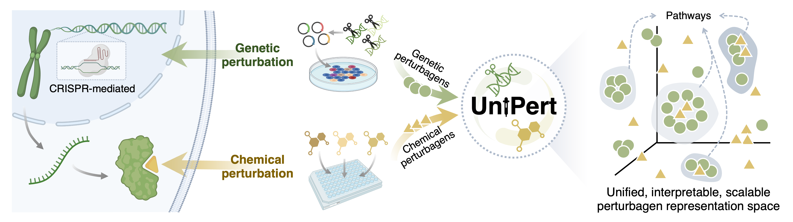

# UniPert




## 🛠️ Installation 

#### Step 1: Create a Conda Environment  
Create a new conda environment with Python 3.9:  
```bash
conda create -n unipert python=3.9 -y
conda activate unipert
```

#### Step 2: Install PyTorch and PyG  
As a prerequisite, you must have **PyTorch** and **PyTorch Geometric (PyG)** installed to use this repository.  

1. Install **PyTorch** based on your system and CUDA version. Visit the [PyTorch website](https://pytorch.org/get-started/locally/) for detailed instructions.  
   We recommend using the development version `torch==1.12.1` for compatibility:  
   ```bash
   # CUDA-support (e.g., CUDA 11.3):
   pip install torch==1.12.1+cu113 torchvision==0.13.1+cu113 torchaudio==0.12.1 --extra-index-url https://download.pytorch.org/whl/cu113

   # CPU-only
   pip install torch==1.12.1+cpu torchvision==0.13.1+cpu torchaudio==0.12.1 --extra-index-url https://download.pytorch.org/whl/cpu
   ```

2. Install **PyG**. Refer to the [PyG installation guide](https://pytorch-geometric.readthedocs.io/en/latest/notes/installation.html) for system-specific instructions.  
   For most users, the following command should suffice:  
   ```bash
   pip install torch-geometric
   ```

#### Step 3: Clone the UniPert Repository  
Clone the UniPert repository to your local machine:
   ```bash
   git clone https://github.com/TencentAILabHealthcare/UniPert.git
   cd UniPert
   ```

#### Step 4: Install Dependencies
Install the required dependencies:
   ```bash
   pip install -r requirements.txt
   ```

##  📖 Demo

| Name | Description |
|-----------------|-------------|
| [🧬 Encode Genetic Perturbagens](demo/tutorial_encode_genetic_perturbagens.ipynb) | Tutorial on how to encode genetic perturbagens from FASTA files or gene name lists using UniPert. |
| [💊 Encode Chemical Perturbagens](demo/tutorial_encode_chemical_perturbagens.ipynb) | Tutorial on how to encode chemical perturbagens from compound-SMILES files (e.g., .csv, .txt, .xlsx) or compound name list using UniPert. |
| [🔗 Encode Perturbagens For Perturbation AnnData](demo/tutorial_generate_UniPert_representation_for_pert_adata.ipynb) | Tutorial on how to generate UniPert embeddings for perturbation AnnData files (.h5ad) with genetic or chemical perturbagen metadata. |

## 🤝 Citation

If you find the models useful in your research, please cite:

```bibtex
@article{li2025unifying,
  title={Unifying Genetic and Chemical Perturbagen Representation through a Hybrid Deep Learning Framework},
  author={Li, Yiming and Zhu, Jun and Liu, Linjing and Wang, Fang and Zeng, Min and Huang, Longkai and Yang, Fan and Li, Min and Yao, Jianhua},
  journal={bioRxiv},
  year={2025},
  publisher={Cold Spring Harbor Laboratory}
}
```

## 🚨 License 

This source code is licensed under the MIT license found in the `LICENSE` file
in the root directory of this source tree.
